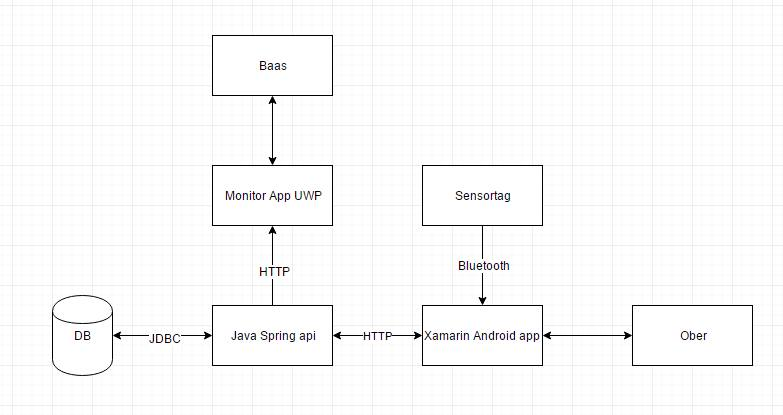

Afgelopen zomer werden er zwoele temperaturen gemeten. Dit betekend kassa kassa voor de horeca. Maar de obers werden niet altijd even efficient ingezet. Tijd om dit probleem aan te pakken. 

In de eerste plaats moet de applicatie het werkgedrag van de ober in kaart brengen. D.m.v. een sensortag aan de onderkant van zijn plateau. Hiermee kan gekeken worden hoelang een ober vanaf de toog tot bij de besteller doet.
Verder wordt door de sensortag ook de stabiliteit van de plateau gemeten. Zo kan de barman de ideale ober aanduiden voor een bepaalde bestelling. Hierdoor kan hij bijvoorbeeld voor een grote bestelling beter iemand kiezen met de vastste hand en voor een kleine bestelling iemand die snel ter plaatsen is. 

In de 2 plaats is de applicate ook voor de ober zelf. Wanneer de ober even niet aandachtig is en zijn plateau nogal snel de verticale richting opzoekt gaat er een alarm af op de sensortag. 

Om te bepalen of een ober bij de toog staat of aan een tafel, zal er gebruik worden gemaakt van magneten. In de toog word dan een magneet voorzien van een groot magnetisme. Wanneer de ober zijn plateau dan neerzet, weet de sensor dat hij bij de toog is.

 